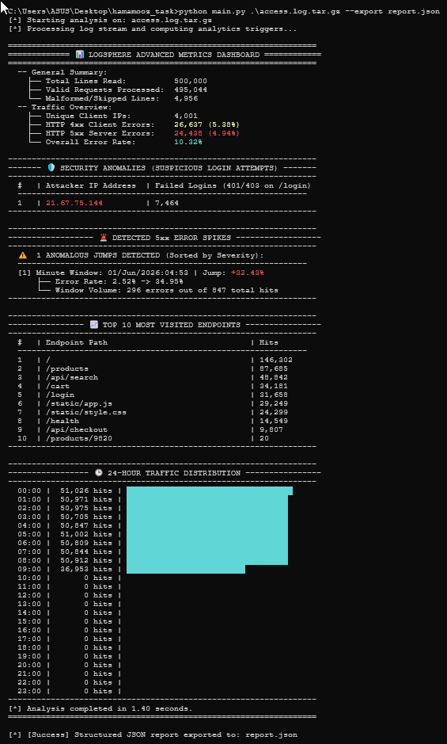
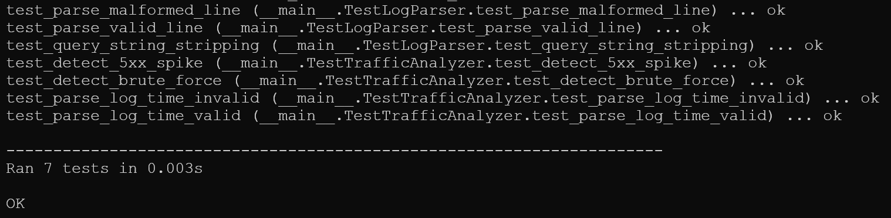

<div dir="rtl">

تصویر داشبورد:


نتیجه تست ها:


</div>


<div dir="rtl">

## ۱. نحوه اجرا

این برنامه با پایتون 3.12 اجرا شده است.

### اجرای تحلیل روی فایل لاگ معمولی:

</div>

```bash
python main.py access.log
```

<div dir="rtl">

### اجرای تحلیل روی فایل لاگ فشرده (پشتیبانی از `.gz` و `.tar.gz`):

</div>

```bash
python main.py access.log.gz
```

<div dir="rtl">
یا
</div>


```bash
python main.py access.log.tar.gz
```

<div dir="rtl">

### اجرای تحلیل همراه با خروجی گزارش به فرمت JSON:

</div>

```bash
python main.py access.log.gz --export report.json
```

<div dir="rtl">

### اجرای تست‌های واحد (Unit Tests):

</div>

```bash
python test.py
```

---

<div dir="rtl">

## ۲. تصمیم‌های مهم در پیاده‌سازی

- **عدم استفاده از Regex (تعبیرهای منظم):** برای پارس کردن خطوط لاگ از عبارات منظم استفاده نشد. به جای آن از متدهای پایه رشته مانند `.find()`، `.strip()` و اسلایسینگ استفاده شد. این تصمیم زمان پردازش فایل‌های حجیم را به طور محسوس کاهش داد.
- **پردازش استریم (خط‌به‌خط):** کل فایل لاگ به یکباره در حافظه بارگذاری نمی‌شود. با استفاده از ساختار حلقه‌های تکرار روی هندل فایل، خطوط به صورت تک‌تک خوانده و پردازش می‌شوند تا میزان مصرف حافظه RAM در زمان مواجهه با فایل‌های چند گیگابایتی در کمترین حد ممکن ثابت بماند.
- **استفاده از ساختارهای داده‌ای استاندارد:** برای ثبت آمار کلاینت‌ها، اندپوینت‌ها و بازه‌های زمانی از `collections.Counter` استفاده شد که مدیریت شمارش در سطح مفسر پایتون را با کارایی بهتری نسبت به دیکشنری‌های دستی انجام می‌دهد.

---

## ۳. برخورد با مشکل در حین کار و نحوه حل آن

### مشکل: مواجهه با فیلدهای دارای کوتیشن‌های داخلی در ساختار لاگ کثیف
فرض شد ممکن است در برخی خطوط لاگ خراب یا تلاش‌های نفوذ، کاراکتر جفت‌کوتیشن (`"`) درون مسیر درخواست (Query String) یا در هدرهای دیگر وجود داشته باشد. در ابتدا استفاده از متد ساده `split('"')` یا پیدا کردن اولین و دومین کاراکتر کوتیشن باعث می‌شد بخش Request به اشتباه استخراج شود و مقدار کد وضعیت (Status Code) و بایت ارسالی جابجا شده یا غیرقابل‌پارس تشخیص داده شوند.

### راه‌حل:
برای حل این مشکل، ساختار تحلیل دستی در فایل `parser.py` بازنویسی شد. یک حلقه بازگشتی پیاده‌سازی شد که ابتدا موقعیت کوتیشن‌های بعدی را پیدا می‌کند و سپس به صورت داینامیک بخش پس از کوتیشن (Tail) را بررسی می‌کند؛ تنها در صورتی کوتیشن به عنوان پایان فیلد درخواست پذیرفته می‌شود که بلافاصله بعد از آن یک کاراکتر فاصله و سپس یک عدد ۳ رقمی معتبر (کد وضعیت) و مقدار بایت پاس داده شده باشد. این مکانیزم، مانع از تاثیر مخرب کوتیشن‌های هرز در بدنه لاگ شد.

### مشکل: ورودی گرفتن فایل فشرده
فایل ورودی فرمت .gz داشت ولی در واقعیت .tar.gz بود. 

### راه‌حل:
پسوند فرمت فایل را به .tar.gz اصلاح کرده و نوع ورودی گرفتن آن را در کد اضافه کردم.

</div>